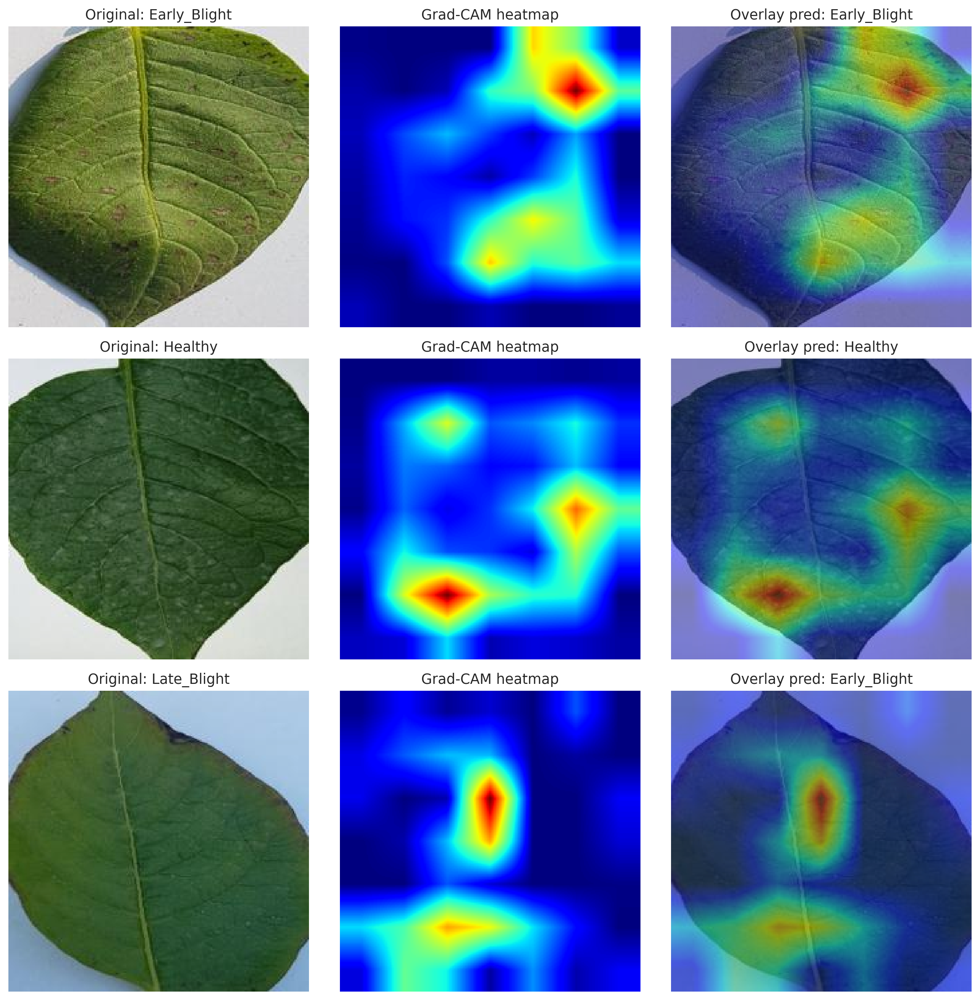
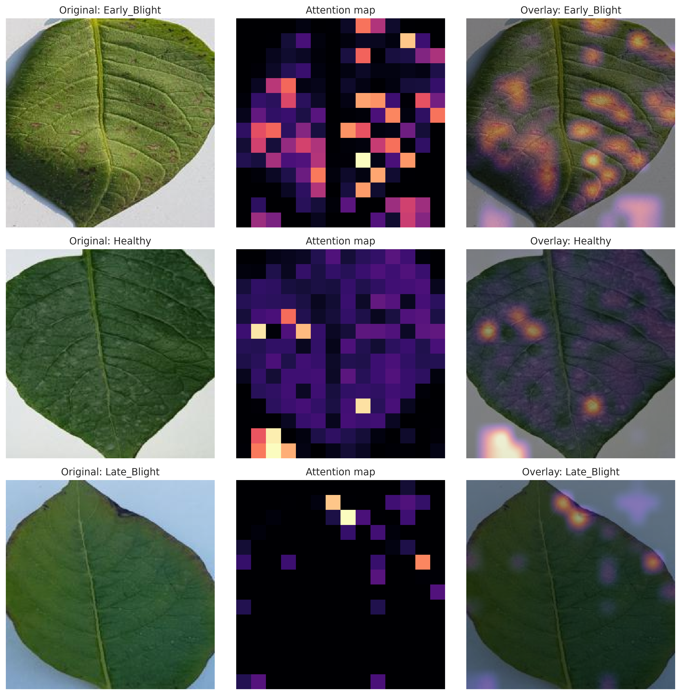
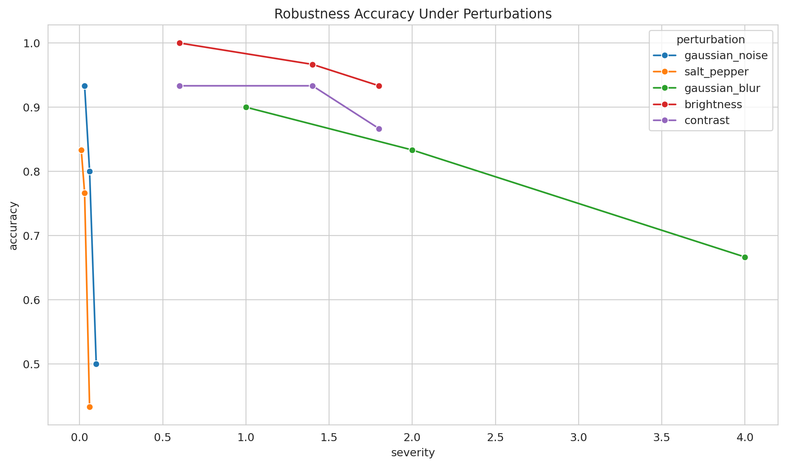
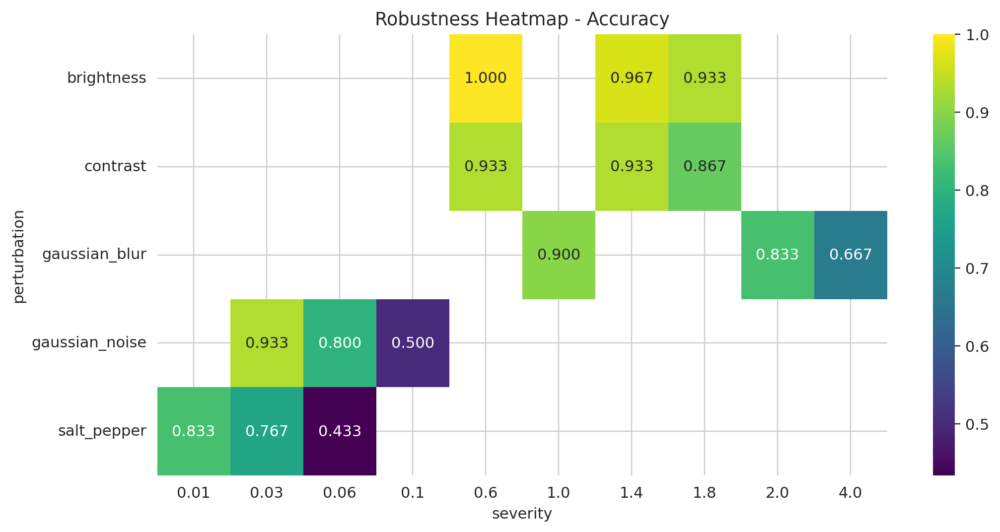

# Explainable Potato Leaf Disease Classification

This repository implements potato leaf disease classification using Vision Transformer and CNN models, with evaluation, explainability, robustness testing, and comparative analysis. 

## Overview

The latest notebook classifies three PLD dataset classes:
- `Early_Blight`
- `Healthy`
- `Late_Blight`

It includes:
- ResNet50 and VIT 3-fold cross-validation with overfitting control
- Grad-CAM and attention-based visualizations
- Robustness testing under synthetic perturbations

---

# Methodology

## Dataset and Experimental Setup

The model is trained and evaluated on the PlantVillage potato leaf disease dataset consisting of three classes: Early_Blight, Healthy, and Late_Blight. The dataset contains 4,072 images, split into training (3,251), validation (416), and testing (405). A combined pool of 3,667 images from training and validation is used for cross-validation.

All images are resized to 224 × 224. Training data undergoes augmentation including random resized crops, horizontal/vertical flips, rotations, affine transformations, color jitter, and random erasing. Evaluation uses deterministic resizing and center cropping. Normalization follows ImageNet statistics.

Training is performed on CUDA-enabled GPUs with DataParallel support.

## Model Architectures

### ResNet50 

A ResNet50 backbone is used as the primary CNN model. The training strategy includes:

* 3-fold cross-validation
* Backbone freezing for initial epochs followed by fine-tuning
* AdamW optimizer
* Learning rate: 1e-4
* Weight decay: 1e-4
* Dropout: 0.30
* Label smoothing: 0.05
* Gradient clipping (max norm 1.0)
* ReduceLROnPlateau scheduler
* Early stopping (patience = 2)

Final predictions are generated using a soft-voting ensemble of the three folds.

### Vision Transformer (ViT)

A transformer-based model (google/vit-base-patch16-224) is trained for comparison:

* 3-fold cross-validation
* Batch size: 8
* Learning rate: 3e-5
* Weight decay: 0.05
* Label smoothing: 0.10
* Dropout: 0.20
* Backbone freezing for initial epochs followed by full fine-tuning

## Explainability Methods

Two explainability approaches are implemented:

* Grad-CAM for CNN models (ResNet50)
* Attention visualization for Vision Transformer

Each method visualizes class-specific focus regions on sample test images.

## Robustness Testing

Model robustness is evaluated under synthetic perturbations:

* Gaussian noise
* Salt-and-pepper noise
* Gaussian blur
* Brightness and contrast variations

Performance is measured using accuracy and F1-score on a balanced subset of 30 images.

---

## GAN Generated Images

## Conditional GAN Architecture

To augment the dataset and analyze class-specific feature generation, a **conditional Deep Convolutional GAN (cGAN)** was implemented. The model conditions both the generator and discriminator on class labels (Early_Blight, Healthy, Late_Blight).

### Generator

* Input: Noise vector (dimension = 100) + class embedding (dimension = 50)
* Architecture: Series of transposed convolution layers (DCGAN-style)
* Activations: ReLU (hidden), Tanh (output)
* Output: 64 × 64 RGB image

The class embedding is concatenated with the noise vector, allowing the generator to produce class-specific images.

### Discriminator

* Input: Image + class label embedding (reshaped to spatial map)
* Architecture: Convolutional layers with progressive downsampling
* Activations: LeakyReLU
* Output: Real/Fake probability (binary classification)

The label embedding is spatially expanded and concatenated with the image channels to enforce conditional discrimination.

### Training Configuration

* Loss: Binary Cross Entropy with Logits
* Optimizer: Adam
* Learning rate: 0.0002
* Beta1: 0.5
* Batch size: 64
* Epochs: 50
* Image size: 64 × 64
* Training split: Training dataset only

### Training Strategy

* Alternate updates between discriminator and generator
* Real images labeled as 1, generated images as 0
* Generator trained to fool discriminator into predicting generated images as real
* Class labels randomly sampled for fake image generation

---

### Generated Samples (after 200 epochs)

The trained GAN generates synthetic potato leaf images for each class. Below are representative samples produced by the generator.

### Early Blight (Synthetic)

The generated Early Blight samples show characteristic lesion-like patterns and texture variations, indicating that the model has learned disease-specific visual cues.

---

### Healthy Leaves (Synthetic)

Healthy class samples exhibit smooth texture and uniform coloration, closely resembling real healthy leaves without disease artifacts.

---

### Late Blight (Synthetic)

Late Blight samples capture irregular dark regions and spread patterns, demonstrating that the GAN can approximate complex disease structures.

---

Generated Samples after 500 epochs

FID score - 44

## Observations

* The conditional setup ensures **class-consistent image generation**
* Generated images retain **semantic features of each disease class**
* Visual diversity improves across epochs due to adversarial training
* Some artifacts remain due to **low resolution (64×64)** and limited training stability

---

# Results (On Original Sample Only)

## ResNet50 3-Fold Cross-Validation
| Fold | Validation Accuracy | Validation F1 |
| ---- | ------------------- | ------------- |
| 1    | 0.9910              | 0.9910        |
| 2    | 0.9926              | 0.9926        |
| 3    | 0.9951              | 0.9951        |
| Mean | 0.9929              | 0.9929        |

The model shows consistent high performance across all folds, indicating strong generalization and minimal overfitting.

### ViT 3-Fold Cross-Validation

| Fold | Validation Accuracy |
| ---- | ------------------- |
| 1    | 0.9730              |
| 2    | 0.9664              |
| 3    | 0.9787              |
| Mean | 0.9665              |

## Robustness Results

| Perturbation      | Severity | Accuracy |
| ----------------- | -------- | -------- |
| Gaussian Noise    | 0.10     | 0.50     |
| Salt & Pepper     | 0.06     | 0.43     |
| Gaussian Blur     | 4        | 0.67     |
| Brightness Change | 1.80     | 0.83     |
| Contrast Change   | 1.80     | 0.76     |

The model is most robust to brightness and contrast changes, moderately sensitive to blur, and highly sensitive to noise.

---

### Explainability Results

ResNet50 Grad-CAM:

The Grad-CAM summary uses one test image from each class and shows the original image, the class activation heatmap, and the heatmap overlay. This helps verify whether the CNN is focusing on disease-relevant leaf regions rather than background artifacts.

ViT attention summary:

The ViT attention summary uses one test image from each class and displays the original image, the attention map, and the attention overlay. This gives a transformer-side qualitative check of where the ViT places attention during classification.

### Robustness Testing

The notebook evaluates robustness on a small balanced test subset of 30 images: 10 images per class. The tested perturbations are Gaussian noise, salt-and-pepper noise, Gaussian blur, brightness shifts, and contrast shifts.

| Perturbation | Severity | Accuracy | F1-score |
| --- | ---: | ---: | ---: |
| Gaussian noise | 0.03 | 0.8333 | 0.8346 |
| Gaussian noise | 0.06 | 0.8000 | 0.8027 |
| Gaussian noise | 0.10 | 0.5000 | 0.4554 |
| Salt and pepper | 0.01 | 0.8333 | 0.8359 |
| Salt and pepper | 0.03 | 0.7667 | 0.7738 |
| Salt and pepper | 0.06 | 0.4333 | 0.3749 |
| Gaussian blur | 1 | 0.8500 | 0.8019 |
| Gaussian blur | 2 | 0.8333 | 0.8375 |
| Gaussian blur | 4 | 0.6667 | 0.6506 |
| Brightness | 0.60 | 0.8700 | 0.8500 |
| Brightness | 1.40 | 0.8667 | 0.8666 |
| Brightness | 1.80 | 0.8333 | 0.9332 |
| Contrast | 0.60 | 0.8333 | 0.8333 |
| Contrast | 1.40 | 0.8333 | 0.8332 |
| Contrast | 1.80 | 0.8667 | 0.8244 |

## Group Members

- ARKO BERA (BT23CSD001)
- VISHAL SINGH (BT23CSD002)
- TANISHQ PARIHAR (BT23CSD005)
- MITHRA (BT23CSD025)
- UTKARSH GAUR (BT23CSD055)
