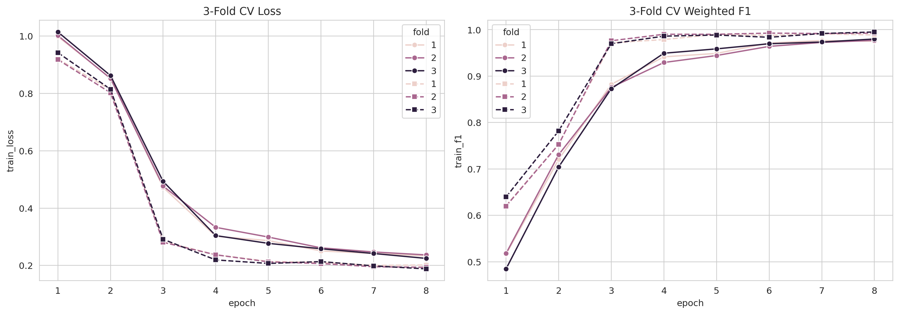
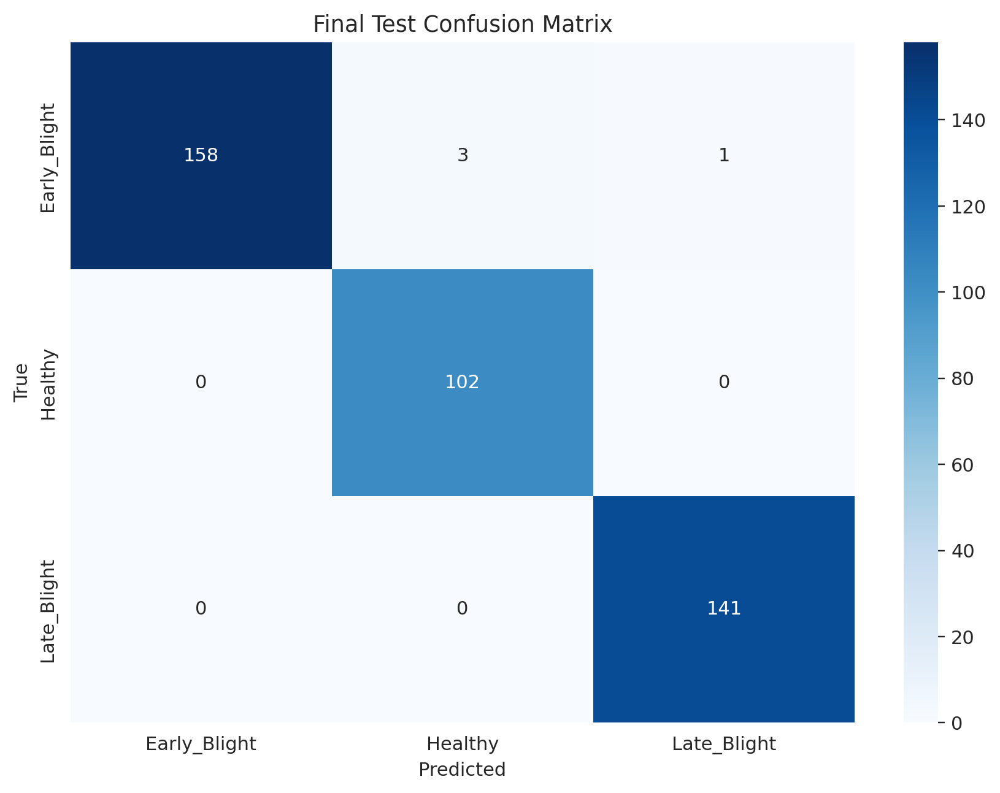
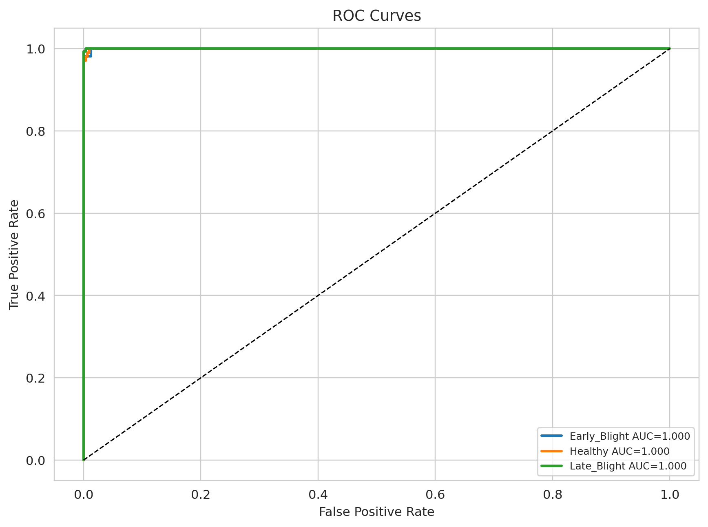

# Explainable Potato Leaf Disease Classification

This repository implements potato leaf disease classification using Vision Transformer and CNN models, with evaluation, explainability, robustness testing, and comparative analysis. 

## Overview

The latest notebook classifies three PLD dataset classes:
- `Early_Blight`
- `Healthy`
- `Late_Blight`

It includes:
- ResNet50 3-fold cross-validation with overfitting control
- ViT training and evaluation for transformer comparison
- ResNet50 and VGG16 comparative training
- Grad-CAM and attention-based visualizations
- Robustness testing under synthetic perturbations
- Final test evaluation, confusion matrix, ROC curves, and inference visualization

## Repository Layout

```text

├── data/
│   ├── PlantVillage/                 # Dataset root used by the scripts
│   └── ViT_XAI_Potato_Assignment-G2.pdf
├── outputs/
│   ├── checkpoints/                  # Trained model checkpoints
│   ├── plots/                        # Training curves, confusion matrices, ROC curves
│   ├── metrics/                      # JSON reports and summaries
│   ├── xai/                          # Explainability images
│   │   ├── vit/
│   │   └── resnet/
│   ├── robustness/                   # Robustness plots
│   ├── comparison/                   # Comparative study plots
│   └── inference/                   # Inference result images
├── scripts/
│   ├── train_gpu.py                  # ViT training script
│   ├── evaluate_model.py             # ViT evaluation script
│   ├── inference.py                  # ViT inference script
│   ├── xai_explainability.py         # ViT explainability script
│   ├── robustness_test.py            # ViT robustness testing
│   ├── comparative_study.py          # ViT vs CNN comparison
│   ├── train_resnet.py               # ResNet50 training script
│   ├── xai_resnet.py                 # ResNet50 explainability script
│   └── project_paths.py              # Shared root/path resolver
├── requirements.txt
├── .gitignore
└── README.md
```

## Directory Rules

The code now assumes the repository root is `potato_leaf/`, and the scripts resolve paths from there.

### Dataset lookup order
The scripts look for the dataset in this order:
1. `data/PlantVillage/`
2. `PlantVillage/` at the repository root as a fallback

### Output structure
All generated artifacts are grouped under `outputs/`:
- `outputs/checkpoints/` for `.pth` checkpoints
- `outputs/plots/` for training plots, confusion matrices, ROC curves
- `outputs/metrics/` for JSON reports and summaries
- `outputs/xai/vit/` for ViT explainability images
- `outputs/xai/resnet/` for ResNet explainability images
- `outputs/robustness/` for robustness plots
- `outputs/comparison/` for comparative study plots
- `outputs/inference/` for inference visualizations

## Installation

### 1. Create a virtual environment

```powershell
python -m venv venv
.\venv\Scripts\Activate.ps1
```

### 2. Install dependencies

```powershell
pip install -r requirements.txt
```

### 3. Verify GPU support

```powershell
python -c "import torch; print(torch.cuda.is_available()); print(torch.cuda.get_device_name(0) if torch.cuda.is_available() else 'CPU only')"
```

## How to Run

Run the scripts from the repository root.

### Train Vision Transformer

```powershell
python scripts/train_gpu.py
```

Outputs:
- `outputs/checkpoints/best_vit_potato_model.pth`
- `outputs/plots/training_history.png`
- `outputs/plots/confusion_matrix_validation.png`
- `outputs/plots/confusion_matrix_test.png`
- `outputs/metrics/training_summary.json`

### Evaluate Vision Transformer

```powershell
python scripts/evaluate_model.py
```

Outputs:
- `outputs/metrics/evaluation_report.json`
- `outputs/plots/confusion_matrix_eval.png`
- `outputs/plots/metrics_comparison.png`
- `outputs/plots/roc_curves.png`

### Run ViT Explainability

```powershell
python scripts/xai_explainability.py
```

Outputs:
- `outputs/xai/vit/xai_example.png`
- `outputs/xai/vit/` batch visualizations if directory evaluation is used

### Run ViT Inference

```powershell
python scripts/inference.py
```

Outputs:
- `outputs/inference/inference_results.png`

### Train ResNet50 Baseline

```powershell
python scripts/train_resnet.py
```

Outputs:
- `outputs/checkpoints/best_resnet_potato_model.pth`
- `outputs/metrics/resnet_training_summary.json`

### Run ResNet Explainability

```powershell
python scripts/xai_resnet.py
```

Outputs:
- `outputs/xai/resnet/` class-wise explainability images
- `outputs/xai/resnet/xai_resnet_summary.png`

### Comparative Study

```powershell
python scripts/comparative_study.py
```

Compares:
- Vision Transformer
- ResNet50
- VGG16
- MobileNetV2

Outputs:
- `outputs/comparison/model_comparison.png`
- `outputs/comparison/training_time_comparison.png`
- `outputs/metrics/comparative_study_results.json`

### Robustness Testing

```powershell
python scripts/robustness_test.py
```

Tests the trained ViT under:
- Gaussian noise
- Salt and pepper noise
- Gaussian blur
- Motion blur
- Brightness changes
- Contrast changes
- JPEG compression

Outputs:
- `outputs/robustness/robustness_results.png`
- `outputs/robustness/robustness_heatmap.png`

## Training Configuration

### Dataset and Runtime
- Dataset root used in the notebook: `/kaggle/input/datasets/rizwan123456789/potato-disease-leaf-datasetpld/PLD_3_Classes_256`
- Classes: `Early_Blight`, `Healthy`, `Late_Blight`
- Training images: `3,251`
- Validation images: `416`
- Testing images: `405`
- Total images: `4,072`
- Cross-validation pool: `3,667` images from Training + Validation
- Runtime device: CUDA with 2 Tesla T4 GPUs using `DataParallel` where applicable

Class distribution:

| Split | Early_Blight | Healthy | Late_Blight | Total |
| --- | ---: | ---: | ---: | ---: |
| Training | 1,303 | 816 | 1,132 | 3,251 |
| Validation | 163 | 102 | 151 | 416 |
| Testing | 162 | 102 | 141 | 405 |
| Total | 1,628 | 1,020 | 1,424 | 4,072 |

### Shared Image Preprocessing
- Image size: `224 x 224`
- Training resize/crop: resize to `256 x 256`, then `RandomResizedCrop(224)`
- Training augmentation: horizontal flip, light vertical flip, rotation, affine translation/shear, color jitter, and random erasing
- Evaluation preprocessing: resize to `256 x 256`, center crop to `224 x 224`
- Normalization: ImageNet mean and standard deviation

### ResNet50 3-Fold Cross-Validation
- Backbone: `torchvision.models.resnet50`
- Purpose: main overfitting-controlled pipeline
- Folds: `3`
- Epochs per fold: up to `8`
- Early stopping patience: `2`
- Batch size: `16`
- Learning rate: `1e-4`
- Weight decay: `1e-4`
- Dropout: `0.30`
- Label smoothing: `0.05`
- Optimizer: AdamW
- Scheduler: ReduceLROnPlateau
- Gradient clipping: max norm `1.0`
- Fine-tuning strategy: CNN backbone frozen for the first 2 epochs, then unfrozen with a lower fine-tuning learning rate
- Final test model: soft-voting probability ensemble of the three ResNet50 fold models

### Vision Transformer
- Backbone: `google/vit-base-patch16-224`
- Epochs: up to `5`
- Early stopping patience: `2`
- Batch size: `8`
- Learning rate: `3e-5`
- Weight decay: `0.05`
- Label smoothing: `0.10`
- Hidden dropout: `0.20`
- Attention dropout: `0.20`
- Optimizer: AdamW
- Fine-tuning strategy: ViT backbone frozen for the first 2 epochs, then unfrozen from epoch 3 onward

### Vision Transformer - (3 Fold Cross Validation)
- Backbone: google/vit-base-patch16-224
- Folds: 3
- Epochs per fold: 7
- Batch size: 32
- Learning rate: 5e-5
- Optimizer: AdamW
- Loss: CrossEntropyLoss
- Image size: 224 × 224

### Comparative Study Models
- ViT: reused from the trained ViT run
- ResNet50: trained for up to `4` epochs
- VGG16: trained for up to `4` epochs
- CNN comparison settings use the same augmentation, ImageNet normalization, AdamW optimizer, label smoothing, dropout, early stopping, and freeze-then-unfreeze fine-tuning pattern as the main ResNet50 pipeline

## Explainability Methods

### ViT
The notebook generates attention-style visualizations from the ViT attention tensors:
- one representative test image per class
- original image
- attention map
- attention overlay on the input image

The exported figure used by this README is:
- `newplots/vit_attention_summary.png`

### ResNet
The notebook generates Grad-CAM visualizations for the CNN model:
- one representative test image per class
- original image
- Grad-CAM heatmap
- Grad-CAM overlay with predicted class

The exported figure used by this README is:
- `newplots/gradcam_resnet50_summary.png`

## Evaluation Metrics

The notebook reports:
- Accuracy
- Precision
- Recall
- F1-score
- Confusion matrix
- ROC curves
- ROC-AUC
- Per-class metric breakdown
- Robustness accuracy and F1-score under synthetic perturbations

## Results Summary

All values below are taken from `potato-se-motapa-badta-hai.ipynb` and the exported figures in `newplots/`. No values from the old `outputs/` directory are used here.

### Dataset Summary

| Metric | Value |
| --- | ---: |
| Total images | 4,072 |
| Training images | 3,251 |
| Validation images | 416 |
| Testing images | 405 |
| CV images | 3,667 |
| Classes | 3 |
| CUDA devices | 2 |
| DataParallel | Enabled |

### 3-Fold ResNet50 Cross-Validation

The strongest and most reliable result in the new notebook is the ResNet50 3-fold cross-validation pipeline. Each fold uses the Training + Validation pool and applies augmentation, label smoothing, dropout, gradient clipping, early stopping, and staged fine-tuning.



| Fold | Best epoch | Validation loss | Validation accuracy | Validation precision | Validation recall | Validation F1 | Training time |
| --- | ---: | ---: | ---: | ---: | ---: | ---: | ---: |
| 1 | 7 | 0.200181 | 0.991006 | 0.991160 | 0.991006 | 0.990986 | 11.783 min |
| 2 | 6 | 0.206639 | 0.992635 | 0.992727 | 0.992635 | 0.992630 | 11.789 min |
| 3 | 8 | 0.188067 | 0.995090 | 0.995154 | 0.995090 | 0.995098 | 11.649 min |
| Mean | - | 0.198296 | 0.992910 | 0.993014 | 0.992910 | 0.992905 | 11.740 min |

Key observations:
- Validation accuracy increased sharply after the CNN backbone was unfrozen.
- All three folds reached at least `0.9910` validation accuracy.
- Fold 3 achieved the best validation F1-score: `0.995098`.
- The mean validation F1-score across folds was `0.992905`.

### ViT Training Summary

| Metric | Value |
| --- | ---: |
| Backbone | `google/vit-base-patch16-224` |
| Best epoch | 4 |
| Validation loss | 0.293962 |
| Validation accuracy | 1.000000 |
| Validation precision | 1.000000 |
| Validation recall | 1.000000 |
| Validation F1-score | 1.000000 |
| Training time | 10.392 min |

ViT epoch history from the notebook:

| Epoch | Training accuracy | Validation accuracy |
| --- | ---: | ---: |
| 1 | 0.6986 | 0.8365 |
| 2 | 0.8622 | 0.8822 |
| 3 | 0.9862 | 0.9928 |
| 4 | 0.9917 | 1.0000 |
| 5 | 0.9914 | 0.9976 |

The ViT result is very strong on the validation split, but the final test result reported by the notebook is based on the ResNet50 3-fold ensemble, not the ViT alone.

### ViT CV Results
| Fold     | Final Train Accuracy | Best Validation Accuracy |
| -------- | -------------------- | ------------------------ |
| 1        | 0.9763               | 0.9730                   |
| 2        | 0.9771               | 0.9664                   |
| 3        | 0.9783               | 0.9787                   |
| **Mean** | **0.9772**           | **0.9665**               |


### Comparative Validation Study

The comparative study uses validation metrics, not the final test set. ViT is reused from the dedicated ViT run, while ResNet50 and VGG16 are trained in the comparison block.

| Model | Best epoch | Validation loss | Validation accuracy | Validation precision | Validation recall | Validation F1 | Training time |
| --- | ---: | ---: | ---: | ---: | ---: | ---: | ---: |
| ViT | 4 | 0.293962 | 1.000000 | 1.000000 | 1.000000 | 1.000000 | 10.392 min |
| ResNet50 | 4 | 0.229220 | 0.980769 | 0.981390 | 0.980769 | 0.980749 | 6.421 min |
| VGG16 | 3 | 0.208052 | 0.992788 | 0.992835 | 0.992788 | 0.992780 | 10.575 min |

Comparative interpretation:
- ViT achieved the best validation score in this comparison block with perfect validation precision, recall, and F1-score.
- VGG16 was the strongest CNN in the short comparison run, reaching `0.992780` validation F1.
- ResNet50 comparison training was shorter than the dedicated 3-fold pipeline, so its comparison score should not be read as the final ResNet50 result.
- The final test model remains the ResNet50 3-fold ensemble because the notebook explicitly evaluates the ensemble on the untouched test set.

### Final Test Evaluation

Final model: `resnet50_3fold_ensemble`

| Metric | Value |
| --- | ---: |
| Test loss | 0.0759 |
| Test accuracy | 0.9901 |
| Test precision | 0.9904 |
| Test recall | 0.9901 |
| Test F1-score | 0.9901 |
| Test images | 405 |

Per-class metrics:

| Class | Precision | Recall | F1-score |
| --- | ---: | ---: | ---: |
| Early_Blight | 1.00 | 0.98 | 0.99 |
| Healthy | 0.97 | 1.00 | 0.99 |
| Late_Blight | 0.99 | 1.00 | 1.00 |
| Macro average | 0.99 | 0.99 | 0.99 |
| Weighted average | 0.99 | 0.99 | 0.99 |

Confusion matrix:



| Actual \ Predicted | Early_Blight | Healthy | Late_Blight |
| --- | ---: | ---: | ---: |
| Early_Blight | 158 | 3 | 1 |
| Healthy | 0 | 102 | 0 |
| Late_Blight | 0 | 0 | 141 |

The confusion matrix shows only 4 errors out of 405 test images. All 4 errors come from the `Early_Blight` class: 3 images are predicted as `Healthy`, and 1 image is predicted as `Late_Blight`. The model correctly classifies every `Healthy` and `Late_Blight` test image.

### ROC-AUC



| Class | ROC-AUC |
| --- | ---: |
| Early_Blight | 1.000 |
| Healthy | 1.000 |
| Late_Blight | 1.000 |

The ROC curves report perfect one-vs-rest AUC values for all three classes. This means the ensemble's probability scores separate each class very strongly, even though the final thresholded predictions still contain 4 classification errors.

### Explainability Results

ResNet50 Grad-CAM:


The Grad-CAM summary uses one test image from each class and shows the original image, the class activation heatmap, and the heatmap overlay. This helps verify whether the CNN is focusing on disease-relevant leaf regions rather than background artifacts.

ViT attention summary:


The ViT attention summary uses one test image from each class and displays the original image, the attention map, and the attention overlay. This gives a transformer-side qualitative check of where the ViT places attention during classification.

### Robustness Testing

The notebook evaluates robustness on a small balanced test subset of 30 images: 10 images per class. The tested perturbations are Gaussian noise, salt-and-pepper noise, Gaussian blur, brightness shifts, and contrast shifts.


| Perturbation | Severity | Accuracy | F1-score |
| --- | ---: | ---: | ---: |
| Gaussian noise | 0.03 | 0.9333 | 0.9346 |
| Gaussian noise | 0.06 | 0.8000 | 0.8027 |
| Gaussian noise | 0.10 | 0.5000 | 0.4554 |
| Salt and pepper | 0.01 | 0.8333 | 0.8359 |
| Salt and pepper | 0.03 | 0.7667 | 0.7738 |
| Salt and pepper | 0.06 | 0.4333 | 0.3749 |
| Gaussian blur | 1 | 0.9000 | 0.9019 |
| Gaussian blur | 2 | 0.8333 | 0.8375 |
| Gaussian blur | 4 | 0.6667 | 0.6506 |
| Brightness | 0.60 | 1.0000 | 1.0000 |
| Brightness | 1.40 | 0.9667 | 0.9666 |
| Brightness | 1.80 | 0.9333 | 0.9332 |
| Contrast | 0.60 | 0.9333 | 0.9333 |
| Contrast | 1.40 | 0.9333 | 0.9332 |
| Contrast | 1.80 | 0.8667 | 0.8644 |

Robustness interpretation:
- The model is most stable under brightness changes, staying between `0.9333` and `1.0000` accuracy.
- Contrast changes also remain strong, with accuracy from `0.8667` to `0.9333`.
- Gaussian blur causes a gradual decline as blur increases, dropping from `0.9000` to `0.6667`.
- Gaussian noise is more damaging at high severity, dropping to `0.5000` accuracy at severity `0.10`.
- Salt-and-pepper noise is the most harmful perturbation in this run, dropping to `0.4333` accuracy and `0.3749` F1-score at severity `0.06`.

### Result Artifacts

The README result figures are taken only from `newplots/`:
- `newplots/training_history.png`
- `newplots/confusion_matrix_test.png`
- `newplots/roc_curves.png`
- `newplots/gradcam_resnet50_summary.png`
- `newplots/vit_attention_summary.png`
- `newplots/robustness_results.png`
- `newplots/robustness_heatmap.png`

## GitHub Guidance

When pushing to GitHub, keep these rules in mind:
- Do not commit `venv/`
- Do not commit the raw dataset if the repository should stay lightweight
- Keep `data/ViT_XAI_Potato_Assignment-G2.pdf` if you want the assignment document tracked in the repo
- Generated files are already grouped under `outputs/`
- Large trained weight files are stored locally in `models/` in this checkout; if you want them versioned on GitHub, use Git LFS or another artifact store because GitHub rejects files larger than 100 MB.

## Troubleshooting

### Checkpoint not found
Make sure you have already trained the model so the checkpoint exists under `outputs/checkpoints/`.

### Dataset not found
Place the PlantVillage dataset in one of these locations:
- `data/PlantVillage/`
- `PlantVillage/` at the repository root

### CUDA not available
Verify that your local PyTorch installation is the CUDA-enabled build and that the NVIDIA driver is installed correctly.

### Script path issues
Run commands from the repository root, not from inside `scripts/`.

## Deliverables

- Source code in `scripts/`
- Dataset in `data/`
- Grouped outputs in `outputs/`
- Installation instructions in this README
- Dependency list in `requirements.txt`

## Group Members

- ARKO BERA (BT23CSD001)
- VISHAL SINGH (BT23CSD002)
- TANISHQ PARIHAR (BT23CSD005)
- MITHRA (BT23CSD025)
- UTKARSH GAUR (BT23CSD055)

## License

Educational project for computer vision and deep learning coursework.
